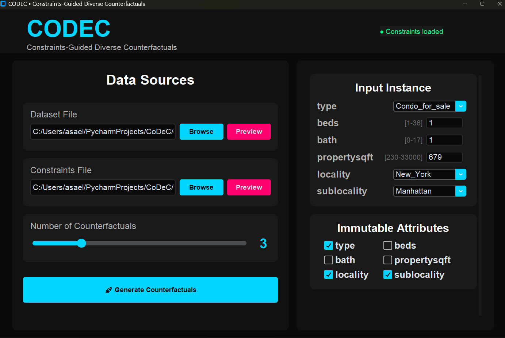
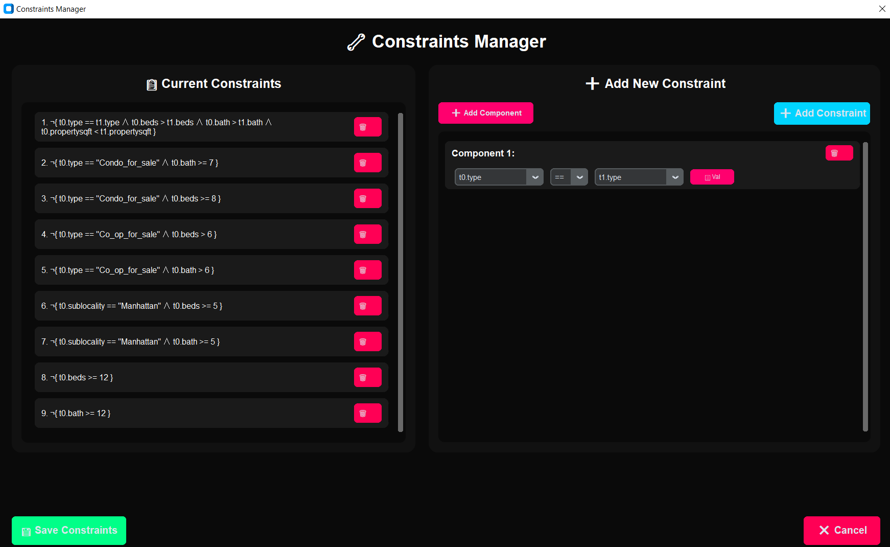

# CODEC: Constraints-Guided Diverse Counterfactuals

This repository contains the implementation of CODEC, a system for generating **constraint-aware counterfactual explanations** for binary classification models. CODEC ensures that generated counterfactuals satisfy domain constraints while maintaining diversity and proximity to the original instance.

## Overview

### What is CODEC?

CODEC (Constraints-Guided Diverse Counterfactuals) addresses a critical limitation in counterfactual explanation generation: **ensuring feasibility**. While traditional methods like DiCE can generate counterfactuals that achieve the desired prediction, they often violate domain constraints, making them unrealistic or impossible in practice.

**Key Innovation:**
- **Constraint-Aware Generation**: Projects infeasible counterfactuals onto the constraint-satisfying manifold using SMT solvers
- **Diversity Optimization**: Generates diverse sets of counterfactuals to provide users with multiple actionable options
- **Interactive GUI**: User-friendly interface for configuring and visualizing results

### Core Approach

CODEC uses a **Perturb-and-Project** methodology:
1. **Perturb**: Generate initial counterfactuals using gradient-based optimization (DiCE)
2. **Project**: Use SMT solver-based projection to enforce denial constraints
3. **Optimize**: Iteratively refine to maximize diversity while maintaining constraint satisfaction

## Key Features

### Counterfactual Generation
- **Constraint Satisfaction**: Ensures all counterfactuals satisfy domain denial constraints
- **Diversity Optimization**: Generates diverse sets using Determinantal Point Process (DPP) scoring
- **Immutable Features**: Respects user-specified immutable attributes (e.g., age, race)
- **Black-Box Compatible**: Works with neural network classifiers

### Interactive GUI
- **Visual Dataset Preview**: Browse and inspect datasets before generation
- **Constraint Manager**: Create, edit, and preview denial constraints interactively
- **Side-by-Side Comparison**: Compare DiCE (unconstrained) vs CODEC (constrained) results
- **Highlighted Changes**: Visual indicators show which attributes changed and by how much

### Evaluation Metrics
- **Proximity**: MAD-normalized distance
- **Diversity**: DPP score
- **Validity**: Automatic constraint violation checking

## Installation

### Using Conda (Recommended)
```bash
# 1. Create conda environment from file
conda env create -f environment.yml

# 2. Activate environment
conda activate my_env_name

# 3. Verify installation
python gui.py
```

### Manual Installation

If you prefer to install dependencies manually:
```bash
# 1. Create environment with Python 3.8+
conda create -n codec python=3.8

# 2. Activate environment
conda activate codec

# 3. Install dependencies
pip install customtkinter dice-ml scikit-learn pandas numpy torch z3-solver
```

### Requirements

Key dependencies:
- Python 3.8+
- customtkinter (GUI framework)
- dice-ml (base counterfactual generation)
- scikit-learn (ML utilities)
- torch (neural networks)
- z3-solver (constraint solving)
- pandas, numpy (data manipulation)

See `environment.yml` for complete dependency list.

## Repository Structure
```
.
├── gui.py                   # Main GUI application
├── class_models.py          # Neural network model definitions
├── environment.yml          # Conda environment specification
├── data/                    # Dataset directory
│   ├── nyhouse.csv         # Example housing dataset
│   └── adult.csv           # Example income dataset
├── constraints/             # Constraints directory
│   ├── ny_DCs.txt          # Example housing constraints
│   └── adult_dcs.txt       # Example income constraints
├── models/                  # Trained model storage
│   └── *.dict              # Model state dictionaries
├── video/                   # Demonstration materials
│   └── CoDeC_Video.mp4     # 3-minute demonstration video
├── images/                  # GUI screenshots
│   ├── Input.PNG           # GUI input tab screenshot
│   ├── constraints.PNG     # Constraints manager screenshot
│   └── Results.PNG         # Results comparison screenshot
└── README.md
```

## Quick Start

### 1. Launch the GUI
```bash
python gui.py
```

### 2. Try the Example

Use the included NY Housing example:

1. **Load Dataset**: Click "Browse" → select `data/nyhouse.csv` → "Preview" to inspect
2. **Load Constraints**: Click "Browse" → select `constraints/ny_DCs.txt` → "Preview" to view
3. **Configure Instance**: Set initial attribute values (defaults provided)
4. **Set Immutability**: Check boxes for immutable features (e.g., locality, sublocality)
5. **Generate**: Click "Generate Counterfactuals" (uses pre-trained model automatically)

### 3. View Results

- **CODEC Tab**: View constraint-satisfying counterfactuals
- **DiCE Tab**: Compare with unconstrained counterfactuals
- **Compare Button**: Side-by-side comparison view
- **Metrics**: Diversity score (DPP) and average distance shown at top

## Dataset Format

### CSV Dataset Structure

Your dataset must follow these requirements:
```csv
feature1,feature2,feature3,...,label
value1,value2,value3,...,0
value1,value2,value3,...,1
```

**Requirements:**
- Last column must be named `label`
- Label values must be 0 or 1 (binary classification)
- Categorical features auto-detected from string columns
- Missing values not supported

**Example (nyhouse.csv):**
```csv
type,beds,bath,propertysqft,locality,sublocality,label
Condo_for_sale,2,1,850,New_York,Manhattan,1
House_for_sale,3,2,1200,New_York,Brooklyn,0
```

### Denial Constraints Format

Constraints define conditions that **must not occur** in valid counterfactuals.

**Format:** `¬{ condition1 ∧ condition2 ∧ ... }`

**Syntax:**
- `t0.` refers to the counterfactual instance being generated
- `t1.` refers to existing database tuples (for relational constraints)
- Operators: `==`, `!=`, `<`, `<=`, `>`, `>=`
- Logical: `∧` (AND)

**Example (ny_DCs.txt):**
```text
¬{ t0.type == "Condo_for_sale" ∧ t0.bath >= 7 }
¬{ t0.type == t1.type ∧ t0.beds > t1.beds ∧ t0.propertysqft < t1.propertysqft }
¬{ t0.beds < t0.bath }
```

**Interpretation:**
1. A condo cannot have 7+ bathrooms
2. Properties of same type: more beds should mean more square footage
3. Beds cannot be less than bathrooms

## GUI Interface Guide

### Input Parameters Tab



**Left Panel - Data Sources:**
- **Dataset File**: Load CSV dataset with "Browse" button
- **Preview**: View random samples from dataset
- **Constraints File**: Load denial constraints text file
- **Preview**: View and edit constraints in Constraints Manager
- **Number of Counterfactuals**: Slider to set desired count (1-10)

**Right Panel - Configuration:**
- **Input Tuple**: Set initial instance attribute values
- **Immutable Attributes**: Check boxes for features that cannot change

### Constraints Manager



**Features:**
- **Current Constraints**: View all active constraints
- **Add New Constraint**: Build constraints using interactive components
- **Remove**: Delete individual constraints with 🗑️ button
- **Save**: Apply changes back to constraint file

**Building Constraints:**
1. Select left attribute (t0.feature or t1.feature)
2. Choose operator (==, !=, <, <=, >, >=)
3. Toggle between attribute comparison or fixed value
4. Add multiple components with "Add Component"
5. Click "Add Constraint" to finalize

### Results Comparison Tab


**Header:**
- **Toggle Buttons**: Switch between CODEC and DiCE results
- **Compare Button**: Above and under comparison view

**Metrics:**
- **Diversity Score**: DPP-based measure of solution variety (higher is better)
- **Avg. Distance**: Mean proximity to original instance (lower is better)

**Results Table:**
- **Initial Row**: Original instance values
- **Counterfactual Rows**: Generated alternatives
- **Change Indicators**: → symbol and color highlighting for modified attributes
- **Distance Column**: Individual proximity score per counterfactual

## Model Handling

CODEC automatically manages model training and caching:

### Pre-trained Models

If a model exists in `models/` matching your dataset name:
- Automatically loaded on generation
- No training delay
- Consistent results across sessions

### Automatic Training

For new datasets without pre-trained models:
- Neural network trained automatically (100 epochs)
- Model saved to `models/{dataset_name}_model_state_dict.dict`
- Reused in future sessions
- Training time: ~1-2 minutes for typical datasets

### Model Architecture

- Multi-layer perceptron (MLP)
- Hidden layer: 100 neurons
- Output: Binary classification (sigmoid)
- Optimizer: Adam (lr=1e-4)
- Loss: Binary cross-entropy

## Advanced Usage

### Adjusting Hyperparameters

Key parameters can be modified at the top of `gui.py`:

#### DiCE Generation Parameters

These parameters control the initial counterfactual generation by DiCE (before projection):
```python
# Learning rates for DiCE gradient-based optimization
LR = 0.03            # Default learning rate (optimized for Adult dataset)
LR_NY = 0.001        # Learning rate for NY Housing dataset

# Iteration bounds for DiCE counterfactual search
MIN_ITER = 250       # Default minimum gradient steps
MAX_ITER = 500       # Default maximum gradient steps
MIN_ITER_NY = 500    # Minimum gradient steps for NY Housing dataset
MAX_ITER_NY = 1500   # Maximum gradient steps for NY Housing dataset
```

**Tips:**
- Higher learning rates converge faster but may be less stable
- More iterations allow DiCE to find better initial counterfactuals but increase runtime
- **For custom datasets**: Modify `LR`, `MIN_ITER`, and `MAX_ITER` (not the `_NY` variants)
- The `_NY` variants are automatically used only for the NY Housing dataset

#### Model Training Parameters
```python
# Neural network training epochs
EPOCHS = 10          # Default epochs for most datasets
NY_EPOCHS = 100      # Epochs for NY Housing dataset (smaller dataset needs more training)
```

**Notes:**
- Larger datasets typically need fewer epochs
- Smaller datasets may require more epochs to avoid underfitting
- Training time scales linearly with epoch count
- **For custom datasets**: Modify `EPOCHS` (not `NY_EPOCHS`)

#### GUI Appearance
```python
# Font scaling for GUI text size
FONT_SCALE = 1.4     # Increase for larger text (e.g., 1.6), decrease for smaller (e.g., 1.0)
```

**Examples:**
- `FONT_SCALE = 1.0` - Default size (smallest)
- `FONT_SCALE = 1.4` - Current setting (40% larger)
- `FONT_SCALE = 1.8` - Extra large for high-DPI displays

#### Debug Mode
```python
# Verbose output for debugging
VERBOSE = True       # Set to False to suppress detailed console output
```

### Custom Dataset Configuration

When adding a new dataset, modify the **default parameters** (not the `_NY` variants):

1. **Tune learning rate:**
```python
LR = 0.01  # Experiment with values between 0.001 and 0.1
```

2. **Set iteration bounds:**
```python
MIN_ITER = 100
MAX_ITER = 500
```

3. **Set training epochs:**
```python
EPOCHS = 50  # Adjust based on dataset size
```

**Note:** The system automatically detects "nyhouse" in the dataset filename and uses the `_NY` variants. For all other datasets, it uses the default parameters.

### Performance Optimization

**For faster generation:**
```python
MIN_ITER = 50          # Reduce minimum iterations
MAX_ITER = 200         # Reduce maximum iterations
LR = 0.05              # Increase learning rate (but may reduce quality)
EPOCHS = 5             # Fewer training epochs
```

**For higher quality:**
```python
MIN_ITER = 500         # Increase minimum iterations
MAX_ITER = 1000        # Increase maximum iterations
LR = 0.01              # Decrease learning rate for finer search
EPOCHS = 50            # More training epochs
```

**Trade-off:** Quality vs. Speed
- Lower iterations + higher LR = Faster, potentially lower quality
- Higher iterations + lower LR = Slower, potentially higher quality

## Troubleshooting

### Common Issues

**Issue**: "No constraints to project"
- **Cause**: Initial instance already satisfies all constraints
- **Solution**: Try a different initial instance or add more constraints

**Issue**: No counterfactuals generated
- **Cause 1**: DiCE failed to generate initial counterfactuals
  - Try adjusting `LR`, `MIN_ITER`, `MAX_ITER` parameters
  - Check if the desired class is achievable given immutable features
- **Cause 2**: Constraints too restrictive or conflicting
  - Review constraints for logical conflicts
  - Simplify constraint set temporarily to diagnose
- **Cause 3**: Model prediction confidence too extreme
  - Instance may be very far from decision boundary
  - Try a different initial instance closer to boundary

**Issue**: Solver timeout errors
- **Cause**: Constraint space too complex for projection
- **Solution**: 
  - Simplify constraints by removing less critical ones
  - Try a different initial instance
  - Note: Some constraint combinations may not have feasible solutions

**Issue**: Model file not found
- **Cause**: Model cache cleared or moved
- **Solution**: System will automatically retrain (takes 1-2 minutes)

**Issue**: Generation is very slow
- **Cause**: High iteration counts or complex constraints
- **Solution**: 
  - Reduce `MAX_ITER` parameter
  - Reduce number of requested counterfactuals
  - For large datasets, reduce `EPOCHS`

### Performance Tips

- **Large datasets (>10K rows)**: Reduce `EPOCHS` to 5-10
- **Many constraints (>20)**: Consider simplifying constraint set
- **Slow DiCE generation**: Reduce `MAX_ITER` or decrease `MIN_ITER`
- **Poor quality counterfactuals**: Increase `MIN_ITER` and `MAX_ITER`

<!---
## Citation

If you use CODEC in your research, please cite:
```bibtex
@software{codec2024,
  title={CODEC: Constraints-Guided Diverse Counterfactuals},
  author={Your Name},
  year={2024},
  url={https://github.com/yourusername/codec}
}
```

## License

[Your License Here - e.g., MIT, Apache 2.0]
--->
## Contact

For questions, issues, or collaboration:
- **Email**: asaelavia@gmail.com
- **GitHub Issues**: [Open an issue](https://github.com/asaelavia/codec/issues)

## Acknowledgments

CODEC builds upon:
- **DiCE**: Diverse Counterfactual Explanations ([Mothilal et al., 2020](https://arxiv.org/abs/1905.07697))
- **Z3 Solver**: Microsoft Research SMT solver
- **CustomTkinter**: Modern GUI framework

---

**Note**: This is research software. While we strive for correctness, please validate results for your specific use case before deployment in production systems.