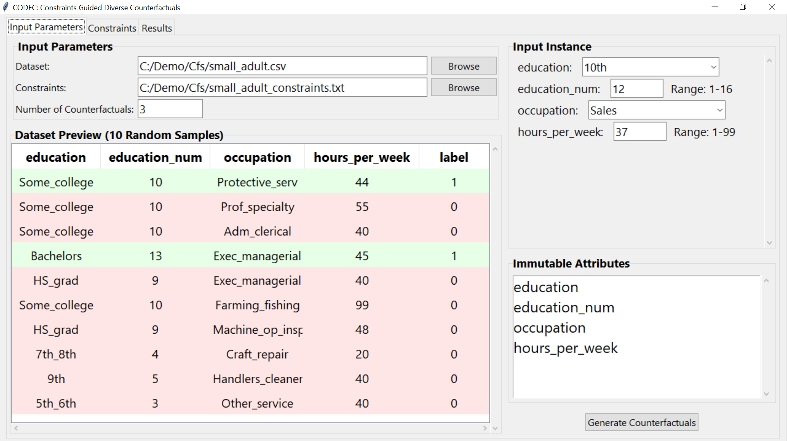
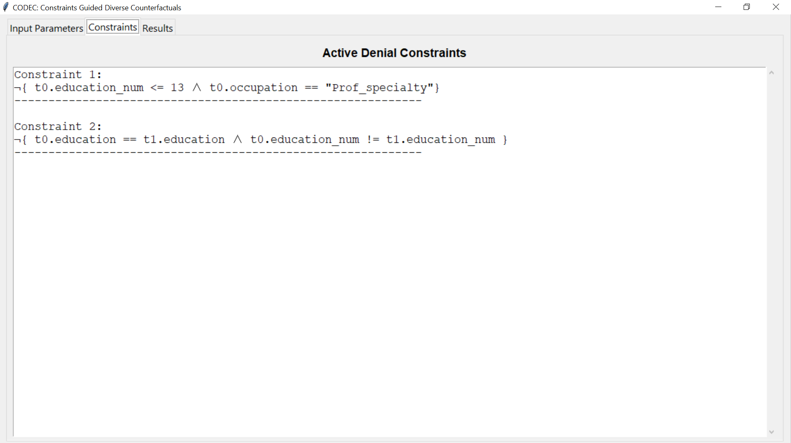
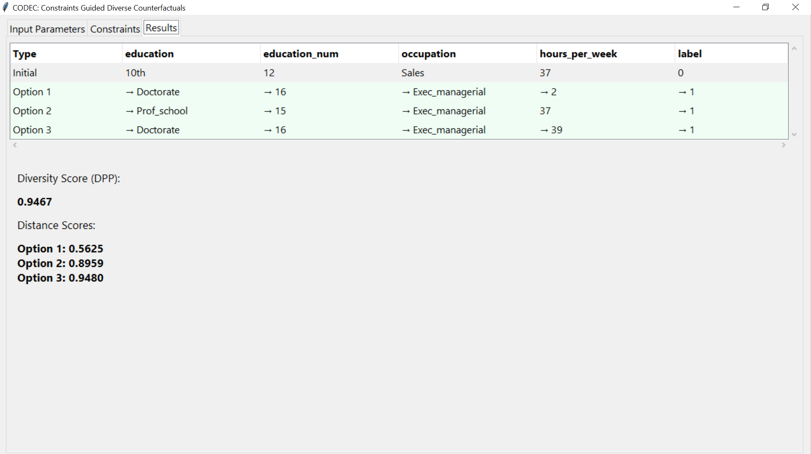

# CODEC: Constraints Guided Diverse Counterfactuals

CODEC generates diverse counterfactual explanations for binary classification models while respecting domain constraints. It helps users understand what changes would lead to different classification outcomes.

## Installation & Usage

Install required packages:
```bash
pip install -r requirements.txt
```

Run the GUI application:
```bash
python gui.py
```

## Quick Demo

Try the included example:
1. Load `small_adult.csv` dataset
2. Load `small_adult_constraints.txt` for constraints
3. The system will automatically use the pre-trained model provided for this dataset

## Interface Overview

### Input Parameters Tab


- **Left**: Load dataset (CSV) and constraints file, set number of counterfactuals
- **Center**: Dataset preview with color-coded classifications (green=positive, red=negative)
- **Right**: Configure instance attributes and select immutable features

### Constraints Tab


Displays active denial constraints that ensure counterfactual feasibility.

### Results Tab


Shows generated counterfactuals with:
- Changed attributes highlighted with arrows (→)
- Diversity score (DPP) measuring solution variety
- Distance scores showing proximity to original instance

## Quick Start

1. Load a binary classification dataset (CSV with 'label' column)
2. Load denial constraints file
3. Configure the instance to explain
4. Mark any immutable attributes
5. Click "Generate Counterfactuals"

## Model Handling

- **Pre-trained models**: If a matching model exists for your dataset, it loads automatically
- **Automatic training**: For new datasets without pre-trained models, the system will train and save a model automatically

## Denial Constraints Format

Constraints should be specified in a text file using the following format:

```
¬{ t0.education_num <= 13 ∧ t0.occupation == "Prof_specialty"}
¬{ t0.education == t1.education ∧ t0.education_num != t1.education_num }
```

Each constraint defines conditions that counterfactuals must not violate.

## Requirements

- Binary classification dataset with 'label' column (0/1)
- Denial constraints text file
- Python environment with dependencies from requirements.txt